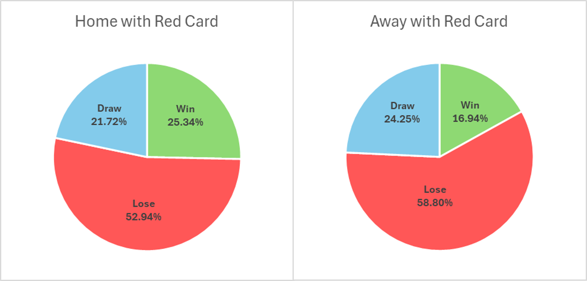

# Introduction
This project explores match statistics from the English Premier League to uncover performance trends and the impact of external factors on team performance. Using SQL and data visualization tools, I analyzed variables such as win percentages, goal averages, disciplinary records, and possession rates—broken down by team and home/away status. The goal of this analysis is to draw meaningful insights from raw match data and demonstrate how data-driven approaches can enhance understanding of team performance in professional football.

# Background
The raw data includes statistics about football matches in the premier league from season 2010/2011 up to season 2019/2020.

The questions I wanted to answer through my SQL queries were:
1. What is the effect of home advantage on team performance?
2. What is the influence of receiving a red card on team performance?
3. What is the relationship between ball possession and match outcome?
4. Who were the best teams in the Premier League between season 10/11 to 19/20?
5. How are the best teams' statistics differ from the league's average?

# Tools I Used
For my in-depth exploration of the Premier League matches, I utilized a set of essential tools:

- SQL: Served as the core of my analysis, enabling me to extract and analyze key insights from the data.
- PostgreSQL: The database management system I used to store and manage football matches data efficiently.
- Visual Studio Code: My primary environment for writing and running SQL queries and managing the database.
- Git & GitHub: Used for version control and sharing my SQL scripts, facilitating collaboration and keeping the project well-documented and organized.

# The Analysis
## 1. The Effect of Home Advantage on Team Performance

To begin my analysis, I examined the overall performance differences between home and away teams in Premier League matches. Using SQL, I calculated key statistics such as win percentage, average yellow and red cards, ball possession, and goals scored and conceded for both sides. This comparison revealed foundational patterns in how playing at home or away influences team performance.


```sql
SELECT
    'home' AS side,
    ROUND(100.0*COUNT(CASE WHEN result = 0 THEN 1 END)/COUNT(*), 2) AS win_percentage,
    ROUND(AVG(home_yellow_cards::numeric), 3) AS yellow_cards_avg,
    ROUND(AVG(home_red_cards::numeric), 3) AS red_cards_avg,
    ROUND(AVG(home_possession::numeric), 2) AS possession_avg,
    ROUND(AVG(goal_home_ft::numeric), 2) AS gf_avg,
    ROUND(AVG(goal_away_ft::numeric), 2) AS ga_avg
FROM football_matches

UNION ALL

SELECT
    'away' AS side,
    ROUND(100.0*COUNT(CASE WHEN result = 1 THEN 1 END)/COUNT(*), 2) AS win_percentage,
    ROUND(AVG(away_yellow_cards::numeric), 3) AS yellow_cards_avg,
    ROUND(AVG(away_red_cards::numeric), 3) AS red_cards_avg,
    ROUND(AVG(away_possession::numeric), 2) AS possession_avg,
    ROUND(AVG(goal_away_ft::numeric), 2) AS gf_avg,
    ROUND(AVG(goal_home_ft::numeric), 2) AS ga_avg
 FROM football_matches
 ```
Here's the breakdown of the influence of home advantage on the team's permormance:

    The home advantage has much influence on the performance of the team.

    - Chance to win in home game - 54% more.

    - 30% more goals in home.

    - Yellow cards - 18% more in away games.

    - Red cards - 37% more in away games.

    - Ball posession doesn't differ much (only 5% more in favor of the home team)


| Side | Win Percentage (%) | Yellow Cards Avg | Red Cards Avg | Possession Avg (%) | Goals For Avg | Goals Against Avg |
|------|--------------------|------------------|----------------|---------------------|----------------|---------------------|
| Home | 45.70              | 1.497            | 0.060          | 51.24               | 1.55           | 1.19                |
| Away | 29.67              | 1.760            | 0.082          | 48.76               | 1.19           | 1.55                |


## 2. The Influence of Receiving a Red Card on Team Performance

In this query, I analyzed football match outcomes based on whether the home or away team received one or more red cards. I calculated the percentages of wins, losses, and draws separately for matches where the home team had red cards and where the away team had red cards. This comparison highlights how receiving red cards on either side impacts the team's match results.

```sql
SELECT
    'home with red card' AS side,
    ROUND(100.0 * COUNT(CASE WHEN result = 0 THEN 1 END) / COUNT(*), 2) AS win_percentage,
    ROUND(100.0 * COUNT(CASE WHEN result = 1 THEN 1 END) / COUNT(*), 2) AS lose_percentage,
    ROUND(100.0 * COUNT(CASE WHEN result = 2 THEN 1 END) / COUNT(*), 2) AS draw_percentage
FROM football_matches
WHERE home_red_cards > 0

UNION ALL

SELECT
    'away with red card' AS side,
    ROUND(100.0 * COUNT(CASE WHEN result = 1 THEN 1 END) / COUNT(*), 2) AS win_percentage,
    ROUND(100.0 * COUNT(CASE WHEN result = 0 THEN 1 END) / COUNT(*), 2) AS lose_percentage,
    ROUND(100.0 * COUNT(CASE WHEN result = 2 THEN 1 END) / COUNT(*), 2) AS draw_percentage
FROM football_matches
WHERE away_red_cards > 0
```
Here's the breakdown of the influence of a red card on the team's permormance:

    1. Red cards greatly reduce win chances.
    Both home and away teams experience a significant drop in win rate when receiving red cards.

    2. Especially harsh for away teams, winning only ~17% of the time when playing a man down — even worse than home teams (~25%).

    3. Home Advantage Still Exists

    <br>

| Side               | Win Percentage (%) | Lose Percentage (%) | Draw Percentage (%) |
|--------------------|--------------------|----------------------|----------------------|
| Home with red card | 25.34              | 52.94                | 21.72                |
| Away with red card | 16.94              | 58.80                | 24.25                |



## 3. The Relationship Between Ball Possession and Match Outcome
In this analysis, I explored the relationship between ball possession and match outcomes in the Premier League. I combined home and away possession data with match results, then categorized each match into possession percentage ranges (e.g., 30–39.9%, 40–49.9%). For each range and team side, I calculated the win, lose, and draw percentages to identify performance trends based on possession levels.

```sql
WITH possession_data AS (
    SELECT
        'home' AS side,
        home_possession AS possession,
        result
    FROM football_matches
    UNION ALL
    SELECT
        'away' AS side,
        away_possession,
        result
    FROM football_matches
),
binned_data AS (
    SELECT
        side,
        result,
        CASE
            WHEN possession BETWEEN 20 AND 29.9 THEN '20-29.9%'
            WHEN possession BETWEEN 30 AND 39.9 THEN '30-39.9%'
            WHEN possession BETWEEN 40 AND 49.9 THEN '40-49.9%'
            WHEN possession BETWEEN 50 AND 59.9 THEN '50-59.9%'
            WHEN possession BETWEEN 60 AND 69.9 THEN '60-69.9%'
            WHEN possession BETWEEN 70 AND 79.9 THEN '70-79.9%'
        END AS possession_range
    FROM possession_data
    WHERE possession BETWEEN 20 AND 79.9
)
SELECT
    side,
    possession_range,
    ROUND(100.0 * COUNT(CASE WHEN (side = 'home' AND result = 0) OR (side = 'away' AND result = 1) THEN 1 END) / COUNT(*), 2) AS win_percentage,
    ROUND(100.0 * COUNT(CASE WHEN (side = 'home' AND result = 1) OR (side = 'away' AND result = 0) THEN 1 END) / COUNT(*), 2) AS lose_percentage,
    ROUND(100.0 * COUNT(CASE WHEN result = 2 THEN 1 END) / COUNT(*), 2) AS draw_percentage
FROM binned_data
WHERE possession_range is NOT NULL
GROUP BY side, possession_range
ORDER BY side DESC, possession_range
```

Here's the breakdown of the influence of the ball possession on the team's permormance:
    
    1. Higher possession = higher win rate.
    For both home and away, win percentage increases steadily as possession increases.

    2. Home win rate grows from 30.36% (20–29.9%) to 60.54% (70–79.9%).
    Away win rate rises from 18.44% to 46.49% over the same range — a big jump, but still lower than home teams.

    3. Home teams consistently outperform away teams. Across all possession ranges, home teams have:
    - Higher win percentages
    - Lower loss percentages

| Side | Possession Range | Win Percentage | Lose Percentage | Draw Percentage |
|------|------------------|----------------|------------------|-----------------|
| Home | 20-29.9%         | 30.36          | 47.32            | 22.32           |
| Home | 30-39.9%         | 39.22          | 37.65            | 23.14           |
| Home | 40-49.9%         | 43.96          | 31.98            | 24.05           |
| Home | 50-59.9%         | 44.29          | 29.02            | 26.70           |
| Home | 60-69.9%         | 53.41          | 21.97            | 24.62           |
| Home | 70-79.9%         | 60.54          | 18.38            | 21.08           |
| Away | 20-29.9%         | 18.44          | 60.34            | 21.23           |
| Away | 30-39.9%         | 22.25          | 53.24            | 24.51           |
| Away | 40-49.9%         | 28.87          | 44.42            | 26.71           |
| Away | 50-59.9%         | 31.40          | 44.51            | 24.09           |
| Away | 60-69.9%         | 37.55          | 38.70            | 23.75           |
| Away | 70-79.9%         | 46.49          | 31.58            | 21.93           |

<br>


## 4. Finding the Best Teams
In order to make a comparison between the teams, I created a unified table combining home and away matches per team per season.

- All the columns are self-explanatory except:
GF - Goals For (the number of goals that the team scored)
GA - Goals Against (the number of goals that were scored against the team)
GD - Goal difference (GF - GA)

- The position of the team in the table is determined by the following priorities:
1. Total points.
2. Goals difference.
3. Number of Wins.

```sql
WITH season_table AS (
SELECT
    season,
    home_team AS team,
    home_table_score AS score,
    goal_home_ft AS gf,
    goal_away_ft AS ga
FROM
    football_matches

UNION ALL

SELECT
    season,
    away_team,
    away_table_score,
    goal_away_ft AS gf,
    goal_home_ft AS ga
FROM
    football_matches
)

SELECT
    season,
    ROW_number() OVER (PARTITION BY season ORDER BY SUM(score) DESC, SUM(gf - ga) DESC, SUM(ga)) AS position,
    team,
    SUM(score) AS points,
    COUNT(CASE WHEN score = 3 THEN score ELSE NULL END) AS won,
    COUNT(CASE WHEN score = 1 THEN score ELSE NULL END) AS drawn,
    COUNT(CASE WHEN score = 0 THEN score ELSE NULL END) AS lost,
    SUM(gf) AS gf,
    SUM(ga) AS ga,
    SUM(gf - ga) AS gd
FROM
    season_table
GROUP BY
    season, team
ORDER BY
    season, position
```
For example, the output of 2010/2011 season:

| Position | Team                    | Points | Won | Drawn | Lost | GF | GA | GD  |
|----------|-------------------------|--------|-----|--------|------|----|----|-----|
| 1        | Manchester United       | 80     | 23  | 11     | 4    | 78 | 37 | 41  |
| 2        | Chelsea                 | 71     | 21  | 8      | 9    | 69 | 33 | 36  |
| 3        | Manchester City         | 71     | 21  | 8      | 9    | 60 | 33 | 27  |
| 4        | Arsenal                 | 68     | 19  | 11     | 8    | 72 | 43 | 29  |
| 5        | Tottenham Hotspur       | 62     | 16  | 14     | 8    | 55 | 46 | 9   |
| 6        | Liverpool               | 58     | 17  | 7      | 14   | 59 | 44 | 15  |
| 7        | Everton                 | 54     | 13  | 15     | 10   | 51 | 45 | 6   |
| 8        | Fulham                  | 49     | 11  | 16     | 11   | 49 | 43 | 6   |
| 9        | Aston Villa             | 48     | 12  | 12     | 14   | 48 | 59 | -11 |
| 10       | Sunderland              | 47     | 12  | 11     | 15   | 45 | 56 | -11 |
| 11       | West Bromwich Albion    | 47     | 12  | 11     | 15   | 56 | 71 | -15 |
| 12       | Newcastle United        | 46     | 11  | 13     | 14   | 56 | 57 | -1  |
| 13       | Stoke City              | 46     | 13  | 7      | 18   | 46 | 48 | -2  |
| 14       | Bolton Wanderers        | 46     | 12  | 10     | 16   | 52 | 56 | -4  |
| 15       | Blackburn Rovers        | 43     | 11  | 10     | 17   | 46 | 59 | -13 |
| 16       | Wigan Athletic          | 42     | 9   | 15     | 14   | 40 | 61 | -21 |
| 17       | Wolverhampton Wanderers | 40     | 11  | 7      | 20   | 46 | 66 | -20 |
| 18       | Birmingham City         | 39     | 8   | 15     | 15   | 37 | 58 | -21 |
| 19       | Blackpool               | 39     | 10  | 9      | 19   | 55 | 78 | -23 |
| 20       | West Ham United         | 33     | 7   | 12     | 19   | 43 | 70 | -27 |

In order to find the best 6 teams I calculated the following factors and prioritized:
1. The average position.
2. Number of times the team has reached the top 4 positions in the table.
3. Number of championships (position 1).
4. Number of appearances in the premier league.

```sql
WITH season_table AS (
SELECT
    season,
    home_team AS team,
    home_table_score AS score,
    goal_home_ft AS gf,
    goal_away_ft AS ga
FROM
    football_matches

UNION ALL

SELECT
    season,
    away_team,
    away_table_score,
    goal_away_ft AS gf,
    goal_home_ft AS ga
FROM
    football_matches
),

filtered_season_table AS (
SELECT
    season,
    ROW_number() OVER (PARTITION BY season ORDER BY SUM(score) DESC, SUM(gf - ga) DESC, SUM(ga)) AS position,
    team
FROM
    season_table
GROUP BY
    season, team
ORDER BY
    season, position
    
)

SELECT
    team,
    average_position,
    top_4,
    league_championships,
    league_appearances
FROM (
    SELECT
    team,
    COUNT(CASE WHEN position = 1 THEN 1 END) AS league_championships,
    COUNT(CASE WHEN position BETWEEN 1 AND 4 THEN 1 END) AS top_4,
    ROUND(AVG(position)::numeric, 0) AS average_position,
    COUNT(*) AS league_appearances

    FROM filtered_season_table
    GROUP BY team
)
ORDER BY average_position, top_4 DESC, league_championships DESC, league_appearances DESC
LIMIT 6
```

The top 6 teams in the Premier League between season 2010/2011 to season 2019/2020 were:

| Team              | Average Position | Top 4 Finishes | League Championships | League Appearances |
|-------------------|------------------|----------------|----------------------|---------------------|
| Manchester City   | 2                | 10             | 4                    | 10                  |
| Chelsea           | 4                | 7              | 2                    | 10                  |
| Manchester United | 4                | 6              | 2                    | 10                  |
| Arsenal           | 4                | 6              | 0                    | 10                  |
| Tottenham Hotspur | 4                | 5              | 0                    | 10                  |
| Liverpool         | 5                | 5              | 1                    | 10                  |


## 5. How Are the Top 6 Teams Differ from other teams?
In this section I analyzez 6 specific Premier League teams (Manchester City, Chelsea, Manchester United, Liverpool, Arsenal, Tottenham Hotspur) and compared their statistics to league averages. I chrckrd the difference between the top 6 teams and the rest of the team by home advantage, playing with a red card and low possession.

### Home Advantage

```sql
WITH stats_by_teams AS (
SELECT
    home_team AS team,
    'home' AS side,
    ROUND(100.0*COUNT(CASE WHEN result = 0 THEN 1 END)/COUNT(*), 2) AS win_percentage,
    ROUND(AVG(home_yellow_cards::numeric), 3) AS yellow_cards_avg,
    ROUND(AVG(home_red_cards::numeric), 3) AS red_cards_avg,
    ROUND(AVG(home_possession::numeric), 2) AS possession_avg,
    ROUND(AVG(goal_home_ft::numeric), 2) AS gf_avg,
    ROUND(AVG(goal_away_ft::numeric), 2) AS ga_avg
FROM football_matches
WHERE home_team IN ('Manchester City', 'Chelsea', 'Manchester United', 'Liverpool', 'Arsenal', 'Tottenham Hotspur')
GROUP BY team

UNION ALL

SELECT
    away_team AS team,
    'away' AS side,
    ROUND(100.0*COUNT(CASE WHEN result = 1 THEN 1 END)/COUNT(*), 2) AS win_percentage,
    ROUND(AVG(away_yellow_cards::numeric), 3) AS yellow_cards_avg,
    ROUND(AVG(away_red_cards::numeric), 3) AS red_cards_avg,
    ROUND(AVG(away_possession::numeric), 2) AS possession_avg,
    ROUND(AVG(goal_away_ft::numeric), 2) AS gf_avg,
    ROUND(AVG(goal_home_ft::numeric), 2) AS ga_avg
FROM football_matches
WHERE away_team IN ('Manchester City', 'Chelsea', 'Manchester United', 'Liverpool', 'Arsenal', 'Tottenham Hotspur')
GROUP BY team
ORDER BY team, side DESC
)

SELECT
    'league average' AS team,
    'home' AS side,
    ROUND(100.0*COUNT(CASE WHEN result = 0 THEN 1 END)/COUNT(*), 2) AS win_percentage,
    ROUND(AVG(home_yellow_cards::numeric), 3) AS yellow_cards_avg,
    ROUND(AVG(home_red_cards::numeric), 3) AS red_cards_avg,
    ROUND(AVG(home_possession::numeric), 2) AS possession_avg,
    ROUND(AVG(goal_home_ft::numeric), 2) AS gf_avg,
    ROUND(AVG(goal_away_ft::numeric), 2) AS ga_avg
FROM football_matches

UNION ALL

SELECT
    'league average' AS team,
    'away' AS side,
    ROUND(100.0*COUNT(CASE WHEN result = 1 THEN 1 END)/COUNT(*), 2) AS win_percentage,
    ROUND(AVG(away_yellow_cards::numeric), 3) AS yellow_cards_avg,
    ROUND(AVG(away_red_cards::numeric), 3) AS red_cards_avg,
    ROUND(AVG(away_possession::numeric), 2) AS possession_avg,
    ROUND(AVG(goal_away_ft::numeric), 2) AS gf_avg,
    ROUND(AVG(goal_home_ft::numeric), 2) AS ga_avg
FROM football_matches

UNION ALL

SELECT
    *
FROM stats_by_teams
```
Here's the breakdown of the of home advantage on the top 6 teams' permormance:

    1. Manchester City is the most dominant team — both offensively and defensively, and home or away.

    2. Home advantage is significant across all metrics: win rate, goals, possession, discipline.

    3. Possession correlates strongly with success, and elite teams sustain it even away from home.

    4. Discipline is worse away, possibly due to pressure, less control, or refereeing bias.


| Team                | Side | Win %  | Yellow Cards Avg | Red Cards Avg | Possession Avg | GF Avg | GA Avg |
|---------------------|------|--------|------------------|----------------|----------------|--------|--------|
| League Average      | Home | 45.70  | 1.497            | 0.060          | 51.24          | 1.55   | 1.19   |
| League Average      | Away | 29.67  | 1.760            | 0.082          | 48.76          | 1.19   | 1.55   |
| Arsenal             | Home | 65.26  | 1.553            | 0.074          | 59.51          | 2.09   | 0.88   |
| Arsenal             | Away | 42.11  | 1.684            | 0.121          | 57.08          | 1.60   | 1.42   |
| Chelsea             | Home | 65.26  | 1.363            | 0.053          | 57.71          | 2.03   | 0.86   |
| Chelsea             | Away | 48.42  | 1.768            | 0.074          | 56.37          | 1.61   | 1.21   |
| Liverpool           | Home | 62.96  | 1.048            | 0.042          | 59.46          | 2.15   | 0.85   |
| Liverpool           | Away | 48.42  | 1.716            | 0.063          | 56.92          | 1.69   | 1.32   |
| Manchester City     | Home | 77.89  | 1.411            | 0.063          | 62.28          | 2.61   | 0.75   |
| Manchester City     | Away | 56.32  | 1.895            | 0.079          | 60.73          | 1.91   | 1.02   |
| Manchester United   | Home | 66.84  | 1.442            | 0.037          | 57.81          | 2.00   | 0.83   |
| Manchester United   | Away | 47.37  | 1.963            | 0.074          | 55.59          | 1.58   | 1.14   |
| Tottenham Hotspur   | Home | 62.11  | 1.447            | 0.037          | 57.56          | 1.85   | 0.92   |
| Tottenham Hotspur   | Away | 45.26  | 1.795            | 0.084          | 55.81          | 1.61   | 1.29   |
<br>


### Playing With A Red Card
```sql
WITH red_card_teams AS (
SELECT
    home_team AS team,
    'home with red card' AS side,
    ROUND(100.0 * COUNT(CASE WHEN result = 0 THEN 1 END) / COUNT(*), 2) AS win_percentage,
    ROUND(100.0 * COUNT(CASE WHEN result = 1 THEN 1 END) / COUNT(*), 2) AS lose_percentage,
    ROUND(100.0 * COUNT(CASE WHEN result = 2 THEN 1 END) / COUNT(*), 2) AS draw_percentage
FROM football_matches
WHERE home_red_cards > 0 AND
home_team IN ('Manchester City', 'Chelsea', 'Manchester United', 'Liverpool', 'Arsenal', 'Tottenham Hotspur')
GROUP BY team

UNION ALL

SELECT
    away_team AS team,
    'away with red card' AS side,
    ROUND(100.0 * COUNT(CASE WHEN result = 1 THEN 1 END) / COUNT(*), 2) AS win_percentage,
    ROUND(100.0 * COUNT(CASE WHEN result = 0 THEN 1 END) / COUNT(*), 2) AS lose_percentage,
    ROUND(100.0 * COUNT(CASE WHEN result = 2 THEN 1 END) / COUNT(*), 2) AS draw_percentage
FROM football_matches
WHERE away_red_cards > 0 AND
away_team IN ('Manchester City', 'Chelsea', 'Manchester United', 'Liverpool', 'Arsenal', 'Tottenham Hotspur')
GROUP BY team
ORDER BY team, side DESC
)

SELECT
    'average' AS team,
    'home with red card' AS side,
    ROUND(100.0 * COUNT(CASE WHEN result = 0 THEN 1 END) / COUNT(*), 2) AS win_percentage,
    ROUND(100.0 * COUNT(CASE WHEN result = 1 THEN 1 END) / COUNT(*), 2) AS lose_percentage,
    ROUND(100.0 * COUNT(CASE WHEN result = 2 THEN 1 END) / COUNT(*), 2) AS draw_percentage
FROM football_matches
WHERE home_red_cards > 0

UNION ALL

SELECT
    'average' AS team,
    'away with red card' AS side,
    ROUND(100.0 * COUNT(CASE WHEN result = 1 THEN 1 END) / COUNT(*), 2) AS win_percentage,
    ROUND(100.0 * COUNT(CASE WHEN result = 0 THEN 1 END) / COUNT(*), 2) AS lose_percentage,
    ROUND(100.0 * COUNT(CASE WHEN result = 2 THEN 1 END) / COUNT(*), 2) AS draw_percentage
FROM football_matches
WHERE away_red_cards > 0

UNION ALL

SELECT *
FROM red_card_teams
```
Here's the breakdown of the effect of red card on the top 6 teams:

    1. Some elite teams maintain strong performance even with a player sent off but not everyone.
    2. The elite teams outperform the average win with a red card.
    3. It's difficult, both for the elite teams to win with a red card.


| Team               | Side                | Win %  | Lose % | Draw % |
|--------------------|---------------------|--------|--------|--------|
| average            | home with red card  | 25.34  | 52.94  | 21.72  |
| average            | away with red card  | 16.94  | 58.80  | 24.25  |
| Arsenal            | home with red card  | 50.00  | 35.71  | 14.29  |
| Arsenal            | away with red card  | 18.18  | 40.91  | 40.91  |
| Chelsea            | home with red card  | 25.00  | 37.50  | 37.50  |
| Chelsea            | away with red card  | 25.00  | 50.00  | 25.00  |
| Liverpool          | home with red card  | 37.50  | 37.50  | 25.00  |
| Liverpool          | away with red card  | 27.27  | 72.73  | 0.00   |
| Manchester City    | home with red card  | 54.55  | 27.27  | 18.18  |
| Manchester City    | away with red card  | 46.67  | 40.00  | 13.33  |
| Manchester United  | home with red card  | 42.86  | 42.86  | 14.29  |
| Manchester United  | away with red card  | 28.57  | 42.86  | 28.57  |
| Tottenham Hotspur  | home with red card  | 28.57  | 57.14  | 14.29  |
| Tottenham Hotspur  | away with red card  | 20.00  | 60.00  | 20.00  |

<br>


### Low Possession
```sql
WITH possession_data AS (
    SELECT
        home_team AS team,
        home_possession AS possession,
        result,
        'home' AS side
    FROM football_matches
    UNION ALL
    SELECT
        away_team AS team,
        away_possession AS possession,
        result,
        'away' AS side
    FROM football_matches
),
binned_data AS (
    SELECT
        team,
        result,
        side,
        CASE
            WHEN possession BETWEEN 20 AND 29.9 THEN '20-29.9%'
            WHEN possession BETWEEN 30 AND 39.9 THEN '30-39.9%'
            WHEN possession BETWEEN 40 AND 49.9 THEN '40-49.9%'
        END AS possession_range
    FROM possession_data
    WHERE possession BETWEEN 20 AND 49.9 AND
    team IN ('Manchester City', 'Chelsea', 'Manchester United', 'Liverpool', 'Arsenal', 'Tottenham Hotspur')
)

SELECT
    team,
    possession_range,
    ROUND(100.0 * COUNT(CASE WHEN (side = 'home' AND result = 0) OR (side = 'away' AND result = 1) THEN 1 END) / COUNT(*), 2) AS win_percentage,
    ROUND(100.0 * COUNT(CASE WHEN (side = 'home' AND result = 1) OR (side = 'away' AND result = 0) THEN 1 END) / COUNT(*), 2) AS lose_percentage,
    ROUND(100.0 * COUNT(CASE WHEN result = 2 THEN 1 END) / COUNT(*), 2) AS draw_percentage
FROM binned_data
WHERE possession_range IS NOT NULL
GROUP BY team, possession_range
ORDER BY team, possession_range
```
Here's the breakdown of the performance of the teams with low possession:

    1. The elite teams are effective and maintain higher winning percentage the the league average, even with low possession.
    2. Some of the teams didn't have a single game with less than 30% possession.

| Team               | Possession Range | Win %  | Lose % | Draw % |
|--------------------|------------------|--------|--------|--------|
| Arsenal            | 30-39.9%         | 38.46  | 38.46  | 23.08  |
| Arsenal            | 40-49.9%         | 47.95  | 31.51  | 20.55  |
| Chelsea            | 20-29.9%         | 66.67  | 33.33  | 0.00   |
| Chelsea            | 30-39.9%         | 60.00  | 20.00  | 20.00  |
| Chelsea            | 40-49.9%         | 49.28  | 11.59  | 39.13  |
| Liverpool          | 30-39.9%         | 35.71  | 21.43  | 42.86  |
| Liverpool          | 40-49.9%         | 61.67  | 18.33  | 20.00  |
| Manchester City    | 30-39.9%         | 33.33  | 50.00  | 16.67  |
| Manchester City    | 40-49.9%         | 71.43  | 14.29  | 14.29  |
| Manchester United  | 20-29.9%         | 100.00 | 0.00   | 0.00   |
| Manchester United  | 30-39.9%         | 47.37  | 21.05  | 31.58  |
| Manchester United  | 40-49.9%         | 59.68  | 19.35  | 20.97  |
| Tottenham Hotspur  | 20-29.9%         | 100.00 | 0.00   | 0.00   |
| Tottenham Hotspur  | 30-39.9%         | 47.62  | 33.33  | 19.05  |
| Tottenham Hotspur  | 40-49.9%         | 47.69  | 29.23  | 23.08  |


# Conclusions
From the analysis, several general insights emerged:

1. Home advantage has proven to be a factor influencing the team's performance in all areas.
2. Red cards greatly reduce win chances.
3. Higher possession = higher win rate.
4. The best 6 teams between season 2010/2011 and season 2019/2020 were:
```
    Manchester City
    Chelsea
    Manchester United
    Arsenal
    Tottenham Hotspur
    Liverpool
```

5. The elite teams in the Premier League outperform the rest of the league. They show greater resilience and deliver better performances even when they are at a disadvantage in terms of possession or when they receive a red card.
